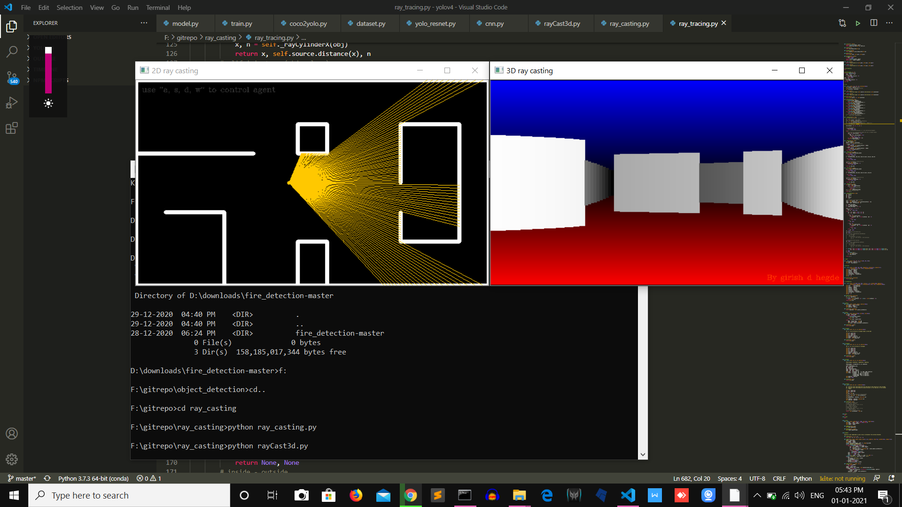
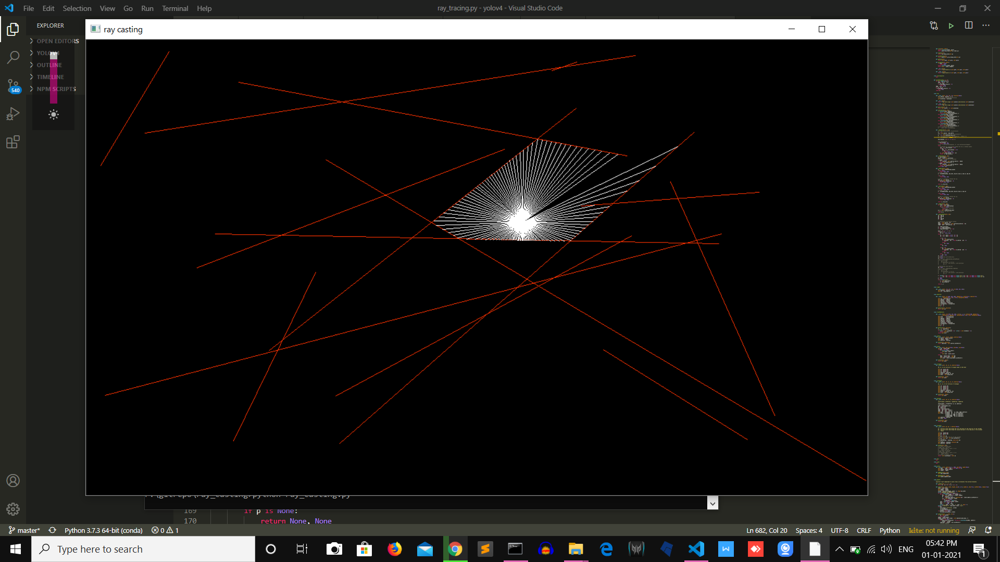

# ray-casting

Ray-casting is 3d **rendering** algorithm which renders psuedo 3d world.

## 2D Ray-Casting Algorithm:
    Initialize:
    walls = [list of line segments with start and end points]
    For angle in Field of View:
        # initialize a ray
        ray = Ray(sorce=(x, y), direction=angle)
        for each wall in walls:
            if ray intersects wall:
                color that point and ray on the canvas
      

## 3D Ray-Casting Algorithm:
    Initialize:
    walls = [list of line segments with start and end points]
    pos   = point(origin=(x, y))
    For angle in Field of View:
        # initialize a ray
        ray = Ray(sorce=(x, y), direction=angle)
        for each wall in walls:
            if ray intersects wall:
                distance = distance(ray.Source, Intersection point)
                line = line_segment with height proportional to distance
                render the above vertical line on canvas
                

##  Here's How To Run The Codes:
***
###  Dependencies:
*  numpy
*  opencv(cv2)

### To test 2D ray casting

    python ray_casting.py
    

### To test 3D ray casting

    python rayCast3d.py
    # use "a, w, s, d" to control the agent

    
                
        
    
